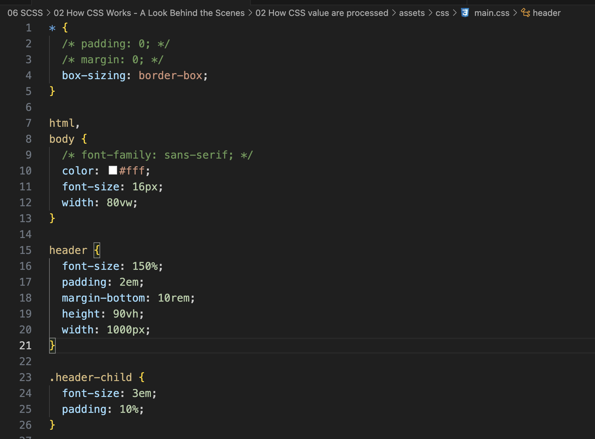
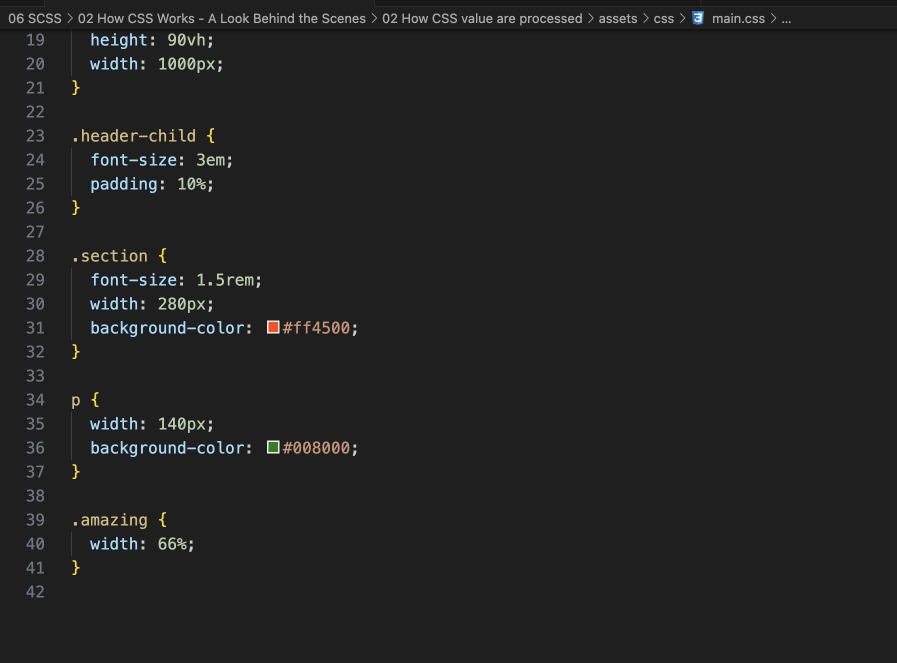

# How CSS Values are processed

|                   |         width          |       padding       |       font-size        |     font-size      |     font-size      |
| :---------------- | :--------------------: | :-----------------: | :--------------------: | :----------------: | :----------------: |
|                   |      (paragraph)       |     (Paragraph)     |         (root)         |     (section)      |    (paragraph)     |
|                   |                        |                     |                        |                    |                    |
| 1.Declared value  |       140px (p)        |          -          |           -            | 1.5rem (.section)  |         -          |
|                   |     66%(.amazing)      |                     |                        |                    |                    |
| 2.Cascaded value  |          66%           |          -          | 16px (browser Default) |       1.5rem       |         -          |
| 3.Specified value |          66%           | 0px (initial value) |          16px          |       1.5rem       | 24px (inheritance) |
| 4.Computed value  |          66%           |         0px         |          16px          | 24px (1.5 \* 16px) |        24px        |
| 5. Used value     | 184.8px (66% of 280px) |         0px         |          16px          |        24px        |        24px        |
| 6.Actual value    |         185px          |         0px         |          16px          |        24px        |        24px        |

1. Declared value - author declaration
2. Cascaded value - after the cascade
3. Specified value - defaulting, if there is no cascaded value
4. Computed value - converting relative values to absolute
5. Used value - final calculations, based on layout
6. Actual value - browser and device restrictions

Code &mdash;

|             | Example (x) | How to convert to Pixels              |          Result in pixels          |
| :---------- | :---------: | ------------------------------------- | :--------------------------------: |
| % (fonts)   |    150%     | x%\* parent's computed font size      |                24px                |
| %(lengths)  |     10%     | x%\* parent's computed width          |               100px                |
| em(font )   |     3em     | x\* parent's computed font-size       |            72px(3\*24)             |
| em(lengths) |     2em     | x\*current element computed font-size |                48px                |
| rem         |    10rem    | x\*root computed font-size            |               160px                |
| vh          |    90vh     | x\* 1% of viewport height             | 90% of the current viewport height |
| vw          |    90vw     | x\* 1% of viewport width              | 90% of the current viewport width  |

`em(font), em(lengths) and rem are font-based`

`vh, vw are viewport-based`

- Each property has an initial value, used if nothing is declared (and if there is no inheritance &mdash; see next lecture);

- Browsers specify a `root font-size` for each page (usually 16px);

- Percentages and relative values are always converted to pixels;

- Percentages are mesured relative to their parent's `font-size`, if used to specify font-size;

- Percentages are measured relative to their partent's `width`, if used to specify lengths;

- em are measured relative to their `parent` font-size, if used to specify font-size;

- em are measured relative to their `current` font-size, if used to specify lengths;

- rem are always measured relative to the `document's root` font-size;

- vh and vw are simply percentage measurements of the viewport's height and width;
