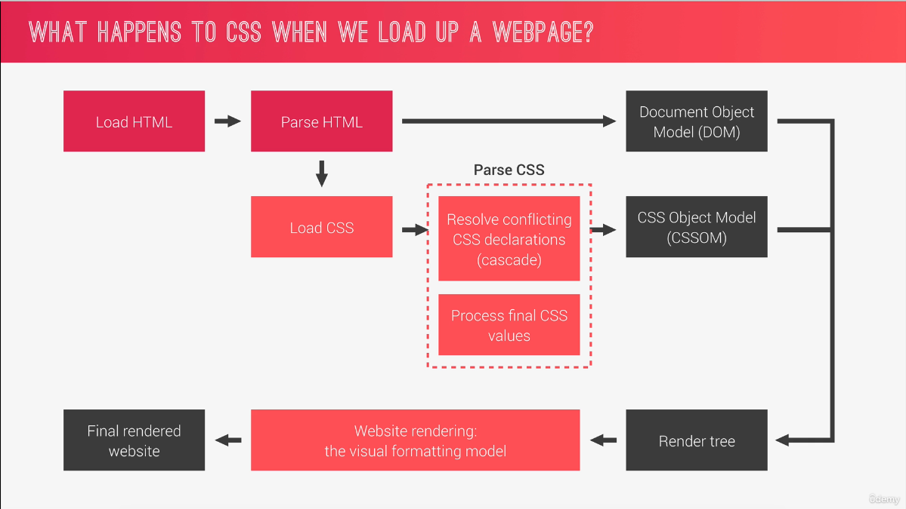

## Three Pillars to write good HTML and CSS and build good websites &mdash;

- `Responsive Design`

  - Fluid Layouts
  - Media Queries
  - Responsive Images
  - Correct Units
  - Desktop-first vs Mobile-first

- `Maintainable and scalable code`

  - Clean
  - Easy-to-understand
  - Growth
  - Reusable
  - How to Organize files
  - How to name classes
  - How to structure HTML

- `Web Performance`

  - Less HTTP Requests
  - Less code
  - Compress code
  - Use a css preprocessor
  - Less images
  - Compress images

  ## What Happens to CSS When we load up a webpage &mdash;



### Load CSS &mdash;

- Resolve conflicting CSS decalrations (cascading).
- Process final CSS value

to CSS Object Model (CSSOM)

`⛔️ DOM + CSSOM => Render Tree => visual formatting Modal => Rendering Colorful and Beautiful Pages. ⛔️`

Process of combining different stylesheets and resolving conflict between different css rule and declaration, when more than one rule applies to a certain element.

eg

```css
font-size: 16px; // Author define
font-size: 20px; // User define by using browser
font-size: 24px; // browser define default (user agent)
```

Importance => Specificity => Source Order

Importance &mdash;

- User !important declarations
- Author !important declarations
- Author declarations
- User declarations
- Default browserdeclarations

Specificity &mdash;

- Inline Style (1,0,0,0)
- IDs (0,1,0,0)
- Classes, pseudo-classes, attribute (0,0,1,0)
- Element, pesudo-elements (0,0,0,1)

```css
.button {
  background: blue; // (0,0,1,0)
}

nav#nav div.pull-right .button {
  background: green; // (0,1,2,2) is applied
}

a {
  background: purple; // (0,0,0,1)
}

#nav a.button:hover {
  background: yellow; // (0,1,2,1)
}
```

Source Order &mdash;

The last declaration in the code will override all other declarations and will be applied.

`Cascade and specificity: What you need to know &mdash;`

- CSS decalarations marked with !important have the highest priority:

- But, only use !important as a last resource. It's better to use correct specificities &mdash; `more maintainable code!`

- Inline style will always have priority over styles in external stylesheets:

- A selector that contains 1 ID is more specific than one with 1000 classes.

- A selector that contains 1 class is more specific than one with 1000 elements:

- The universal selector \* has no specificity value (0,0,0,0)

- Rely more on sepcificity than no the order of selectors.

- But, rely on order when using 3rd-party stylesheets &mdash; always put your author stylesheet last.
