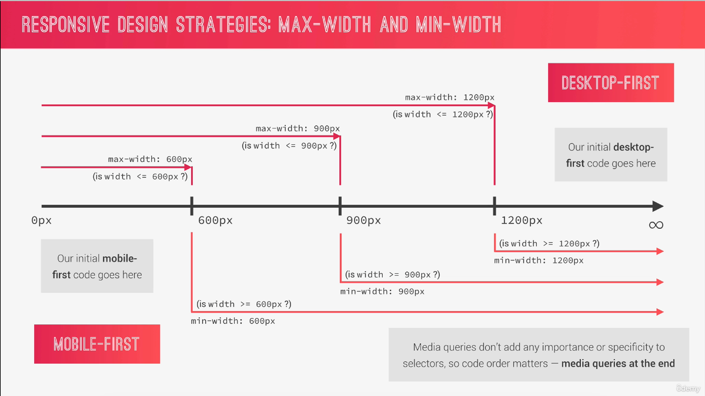
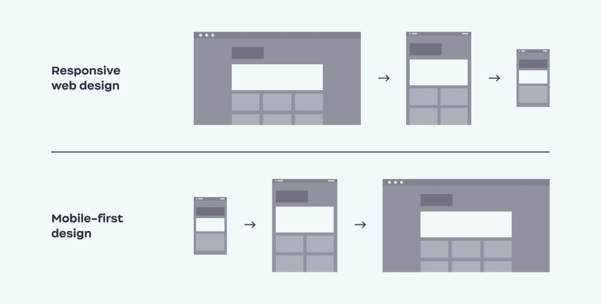
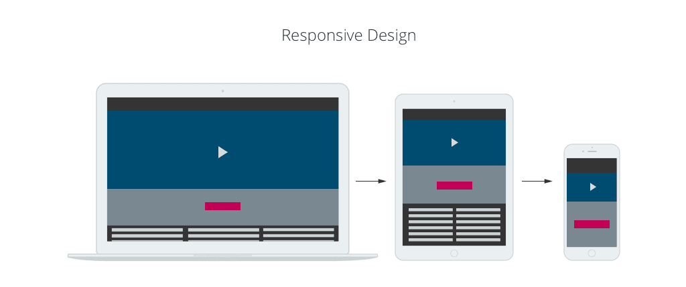
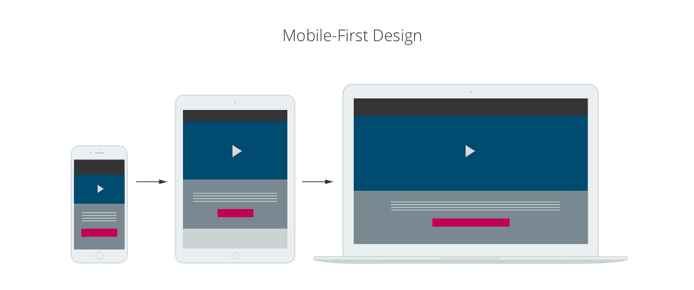
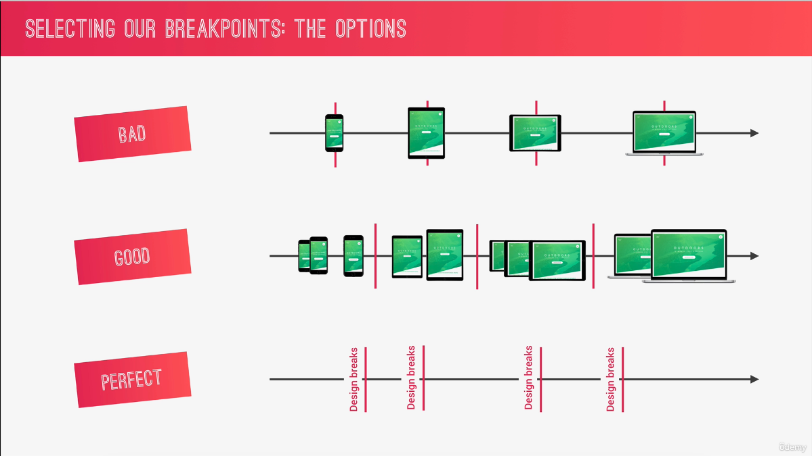
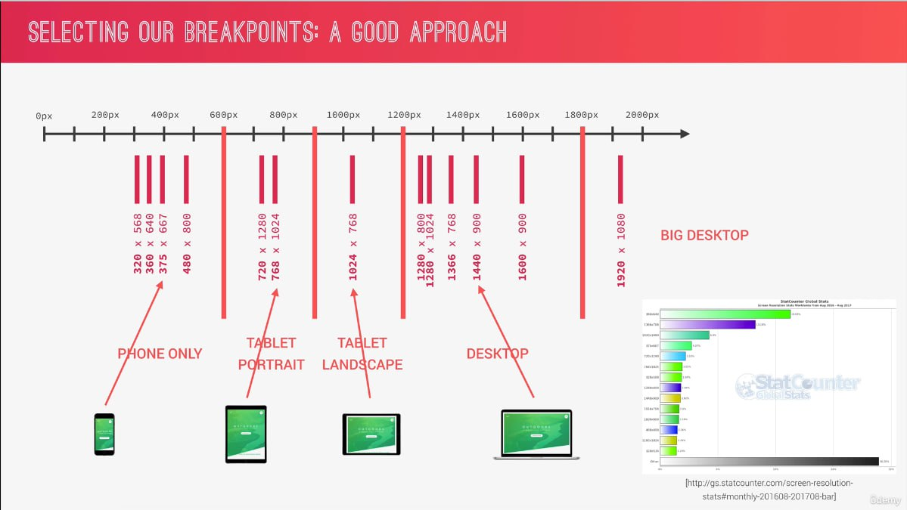
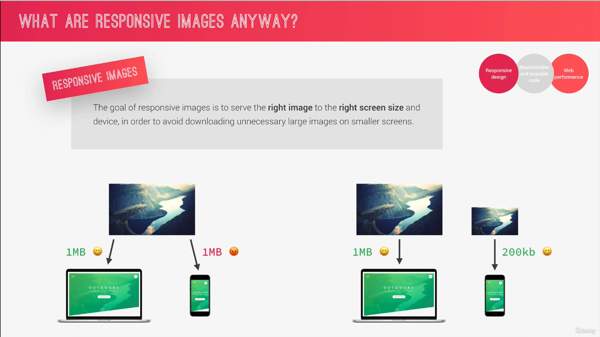
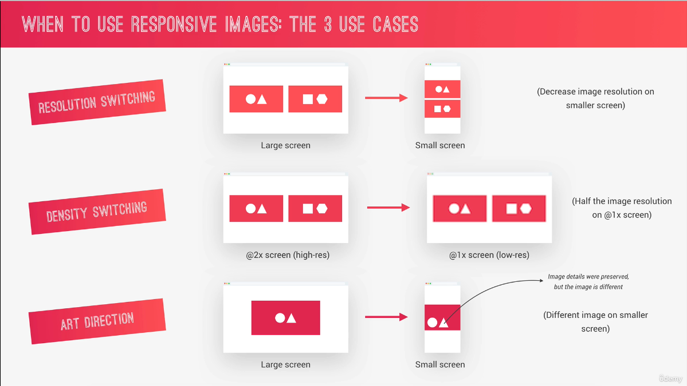
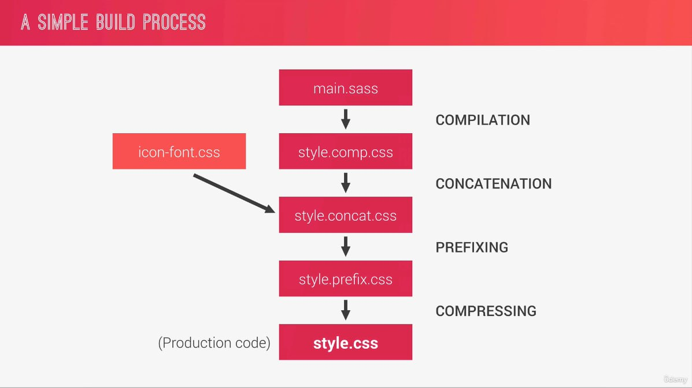

## Responsive Design Strategies

- Start writing CSS for the desktop: large screen:

- Then, media queries shrink design to smaller screens

<br />

```scss
// Font size responsive

html {
  font-size: 20px;
}
@media (max-width: 600px) {
  html {
    font-size: 16px;
  }
}
```

<br />

- CSS Writing `CSS` for mobile devices: small screen;

- Then, media queries expand design to a large desktop screen

- Forces us to reduce websites and apps to the absolute essentials.

<br />

```scss
// Font size responsive

html {
  font-size: 16px;
}
@media (min-width: 600px) {
  html {
    font-size: 20px;
  }
}
```

## Responsive Break Points &mdash;



> max-width for desktop-first and min-width for mobile-first

## Is Mobile-first right for you?

### PROS &mdash;

- 100% optimised for the mobile experience:

- Reduces websites and apps to the absolute essentials:

- Results in smaller, faster and more efficient products:

- Prioritizes content over aesthetic design, which may be desirable.

### CONS &mdash;

- The desktop version might feel overly empty and simplistic:

- More difficult and counterintuitive to develop:

- Less creative freedom, making it more difficult to create distinctive products:

- Clients are used to see a desktop version of the site as a prototype:

- Do your users even use the mobile internet? What's the purpose of your website.

<br />



- `Responsive design` starts on the desktop - that is, at the maximum required resolution, and then scales down to the smallest screen. Even though the content and layout contract to fit smartphones' screens, the navigation, content and download speeds are geared more for your traditional website. &mdash; `ref: Internet`

- `Mobile-first` design is similar to designing a mobile app and then adapting the layout so that it can be viewed neatly on tablet and desktop devices without too many modifications. Your whole design and layout are based on providing excellent mobile user-experience: fast download speeds, rich media content to keep your target audience interested, easy touchscreen navigation and so on. &mdash; `ref: Internet`

> No Matter What You Do. Always Keep Both Desktop And Mobile in Mind!

> in media query unit come from` browser font size`. do not use `root font size`. `em` is the best option for media query

## WHY RESPONSIVE WEB DESIGN? &mdash;



Generally, responsive design is more common among B2B companies where the website content needs to be informative and authoritative. Rich HTML content that is structured correctly is also great for SEO.

As a digital agency, we are mainly targeting other businesses, and we know that 80% of users are on a laptop or desktop and they are accessing our site during office hours. As such, responsive design is the best approach. The Darwin Digital content, navigation, and layout are responsive to smartphones and tablets, providing an excellent UX for our mobile users.

Pros – Good for heavily stacked information websites – Easier for large forms and complex call-to-actions – Cost-effective development and maintenance – Great for SEO

Cons – The mobile experience is not 100% optimized &mdash; `ref: Internet`

## WHY MOBILE-FIRST WEB DESIGN? &mdash;



<br />

Responsive design sounds good, we hear you say. Why should you risk a mobile-first design? Quite simply, the stats show that we have become addicted to surfing on mobile devices. As of last quarter of 2021, 54.4% of the total traffic on the Internet is done via mobile phones. With this information in mind, it is essential to understand what mobile-first web design is and what are its benefits.

Unlike responsive design, mobile-first is about a complete mobile user-experience: adapted app-like user-interface, less text, larger fonts, fast download speed, video and audio, one call-to-action per page, short forms, etc. Additionally, mobile browsers will soon have access to more of the smartphone features like camera, haptic feedback, voice detection, so that a mobile-first design will be able to provide a unique experience to put your site ahead of the competition and drive traffic to it.

Pros – Better user-experience on mobile devices – Majority of internet browsing is on a smartphone – Design website to use built-in phone features – Cheaper than building an iOS, Android or Hybrid App

Cons – The desktop experience is not 100% optimized – Not suited for content-heavy websites &mdash; `ref: Internet`

## WHY MOBILE-FIRST WEB DESIGN? &mdash;


Responsive design sounds good, we hear you say. Why should you risk a mobile-first design? Quite simply, the stats show that we have become addicted to surfing on mobile devices. As of last quarter of 2021, 54.4% of the total traffic on the Internet is done via mobile phones. With this information in mind, it is essential to understand what mobile-first web design is and what are its benefits.

Unlike responsive design, mobile-first is about a complete mobile user-experience: adapted app-like user-interface, less text, larger fonts, fast download speed, video and audio, one call-to-action per page, short forms, etc. Additionally, mobile browsers will soon have access to more of the smartphone features like camera, haptic feedback, voice detection, so that a mobile-first design will be able to provide a unique experience to put your site ahead of the competition and drive traffic to it.

Pros – Better user-experience on mobile devices – Majority of internet browsing is on a smartphone – Design website to use built-in phone features – Cheaper than building an iOS, Android or Hybrid App

Cons – The desktop experience is not 100% optimized – Not suited for content-heavy websites &mdash; `ref: Internet`

## Selecting Our Breakpoints: The Options &mdash;

- Bad - Popular Devices (iphone, ipad) for their screen width.

  <br />





## What you will learn in this lecture &mdash;

- How to use powerful Sass mixing to write all our media queries:

- How to use the `@content` and `@if` Sass directives:

- Taking advantage of `Chrome Devtools` for responsive design

```scss
@mixin clearFix {
  &::after {
    content: "";
    display: table;
    clear: both;
  }
}

@mixin absCenter {
  position: absolute;
  top: 50%;
  left: 50%;
  transform: translate(-50%, -50%);
}

// MEDIA QUERY MANAGER
/* 
0 - 600    :    Phone
600 - 900  :    Tablet Protrait
900 - 1200 :    Tablet Landscape
[1200 - 1800] : is where our normal styles apply
1800px + :      Big Desktop
*/

// @mixin respond-phone {
//   @media (max-width: 600px) {
//     @content;
//   }
// }

/* 
$breakpoint arguement choices:

- phone
- tab-port
- tab-land
- big-desktop

ORDER: Base + typography > general layout + grid > page layout > components

1em = 16px
*/
@mixin respond($breakpoint) {
  @if ($breakpoint == phone) {
    @media (max-width: 37.5em) {
      @content;
    }
  }

  @if ($breakpoint == tab-port) {
    @media (max-width: 56.25em) {
      @content;
    }
  }

  @if ($breakpoint == tab-land) {
    @media (max-width: 75em) {
      @content;
    }
  }

  @if ($breakpoint == big-desktop) {
    @media (min-width: 112.5em) {
      @content;
    }
  }
}
```

## When to use responsive images &mdash;

- `Responsive Images` - The goal of responsive images is to serve the `right image` to the `right screen size` and device, in order to avoid downloading unnecessary large images on smaller screens.

<br />



<br />

- `Responsive Switching` - Decrease image resolution on smaller screen.

- `Density Switching` - Half the image resolution on !1 x screen

- `Art Direction` - Differnt image on smaller screen

<br />



## What you will learn in this lecture &mdash;

- How to use the `srcset` attribute on the `` and `<source>` elements, together with density descriptions:

- How and why to use the `<picture>` element for art direction:

- How to write media queries in HTML

<br />

## What you will learn in this lecture &mdash;

- How to allow the browser to decide the best image to download, using `scrset` attribute, width descriptiors, and the `size` attribute of the `` element.

<br />

## What you will learn in this lecture &mdash;

- How to implement responsive images in CSS:

- How to use resolution media queries to target `high-resolution screens with 2x`:

- How to combine multiple conditions in media queries.

<br />

You can use the device emulator for this. If you're looking for specific display densities, here are some devices to try:

- 1x density Blackberry Playbook, many external monitors
- 2x density iPad or IPhone 5/6
- 3x density Galaxy S5 or iPhone X

<br />

## How does it work? &mdash;

The concept of density descriptors may be unfamiliar to most folks. To better understand them, it helps to have a bit of background on how the browser works with pixels.

### What are pixels &mdash;

Let's start at the very beginning by defining what a pixel is. This sounds simple, but "pixel" can actually have many meanings:

### Device pixel (a.k.a. "physical pixel")

- The smallest dot of color that can be displayed on a device.
  Logical pixel

- Information that specifies the color at a particular location on a grid. This type of pixel has no inherent physical size.

### CSS pixel

- The CSS spec defines a pixel as a unit of physical measurement. 1 pixel = 1/96th of an inch.

### Pixel Density

Pixel density (also referred to as "screen density" or "display density") measures the density of device pixels in a given physical area. This is commonly measured using pixels per inch (ppi).

For many years, 96 ppi was a very common display density (hence CSS defining a pixel as 1/96th of an inch). Starting in the 1980s it was the default resolution of Windows. In addition, it was the resolution of CRT monitors.

This began to change as LED monitors became common in the 2000s. In particular, Apple made a big splash in 2010 when it introduced Retina displays. These displays had a minimum resolution of 192 ppi, which was twice the resolution of "regular" displays (192 ppi/96 ppi = 2).

### window.devicePixelRatio

With the introduction of newer display technology, "device pixels" began to vary in physical size and shape and were no longer the same size as "CSS pixels". The need to define the relationship between the size of "device pixels" and "CSS pixels" is what led to the introduction of the `devicePixelRatio` (sometimes called the "CSS Pixel Ratio").

`devicePixelRatio` defines the relationship between device pixels and CSS pixels for a particular device. A 192 ppi device has a `devicePixelRatio` of 2 (192 ppi/96 ppi = 2) because "2 of its display pixels are the size of 1 CSS pixel".

These days most devices have a `device-pixel-ratio` between 1.0 and 4.0.

> Note: This ratio doesn't have to be a whole number. 1.5, 2.4, and 2.5 are all device-pixel-ratios of common devices.

- Determine the pixel density of a device by typing `window.devicePixelRatio` in the console.

- View this table to see the pixel ratios of common devices. Most are between `1.0` and `4.0`.

So how do you actually apply this information?

### Size images based on device-pixel-ratios

In order for images to look their very best on high resolution screens, it's necessary to provide different image versions for different `devicePixelRatios`.

| Device Pixel Ratio | Indicates that: | On this device, an  tag with a CSS width of 250 pixels, will look best when the source image is... |
| :----------------- | --------------- | ------------------------------------------------------------------------------------------------------- |
| 1                  | 1               | device pixel = 1 CSS pixel 250 pixels wide                                                              |
| 2                  | 2               | device pixels = 1 CSS pixel 500 pixels wide                                                             |
| 3                  | 3               | device pixels = 1 CSS pixel 750 pixels wide                                                             |

<br />

Things to note:

- The pixel dimensions listed in image editors, file directories, and other places are a measurement of logical pixels.

- For higher resolution screens and larger displays you'll need images with larger dimensions. Merely enlarging smaller images defeats the purpose of serving multiple image versions. The browser would have done this anyway if a high resolution image was not provided.

> Note: Tools like sharp make it easy to create multiple sizes of an image. This is covered in more detail here.

### Use Density Descriptors to serve multiple images

Density descriptors, in conjunction with the "srcset " attribute, can be used to serve different images to different `devicePixelRatios`.

- Take a look at the index.html file and note the  element.

<br />

```html

```

This example put into words:

- `1x`,`2x`, and `3x` are all density descriptors that tell the browser the pixel density that an image is intended for. This saves the browser from needing to download an image to determine this information.

- The browser can choose between three images: `flower-1x.jpg` (intended for browsers with a `1.0` pixel density), `flower-2x.jpg` (intended for browsers with a `2.0` pixel density), and `flower-3x.jpg` (intended for browsers with a `3.0` pixel density).
  `flower.jpg` is the fallback image for browsers that do not support srcset.

#### How to use this:

- Use a `devicePixelRatio` and the x unit to write density descriptors. For example, the density descriptor for many Retina screens (`window.devicePixelRatio = 2`) would be written as `2x`.

- If a density descriptor isn't provided, it is assumed to be `1x`.
  Including density descriptors in filenames is a common convention (and will help you keep track of files) but is not necessary. Images can have any filename.

- There is no need to include a sizes attribute. The sizes attribute is only used with width descriptors.

<br />

## Unit &mdash;

- em: 1em is equal to the current font size. 2em means 2 times the size of the current font. E.g., if an element is displayed with a font of 12 pt, then '2em' is 24 pt. The 'em' is a very useful unit in CSS, since it can adapt automatically to the font that the reader uses

- pt: point (1 pt is the same as 1/72 inch)

- pc: pica (1 pc is the same as 12 points)

### What you will learn in this lecture &mdash;

- How to use `@support` feature queries:

- Implement graceful degradation on selected properties:

- How to use `backdrop-filter`.

<br />

## A SIMPLE BUILD PROCESS &mdash;



## Install Concat &mdash;

```sh
  npm install concat --save-dev

  or

  npm install concat -save
```

in Package.json &mdash;

```js
"concat:css": "concat -o output.css ./1.css ./2.css ./3.css";
```

```js
  "watch:sass": "node-sass ./assets/scss/main.scss ./assets/css/main.css -w",
    "devserver": "live-server",
    "start": "npm-run-all --parallel devserver watch:sass",
    "compile:sass": "node-sass ./assets/scss/main.scss ./assets/css/main.css",
    "concat:css": "concat -o ./assets/css/main.concat.css ./assets/css/icon-fonts.css ./assets/css/main.css",
    "prefix:css": "postcss --use autoprefixer -b 'last 10 versions' ./assets/css/main.concat.css -o ./assets/css/main.prefix.css ",
    "compress:css": "node-sass ./assets/css/main.prefix.css ./assets/css/main.min.css --output-style compressed",
    "build:css": "npm-run-all concat:css prefix:css compress:css"
```

<br />

## Install Autoprefixer and Postcss &mdash;

```sh
  npm install node-sass --save-dev
  npm install autoprefixer --save-dev
  npm install postcss-cli --save-dev
  npm install npm-run-all --save-dev
```

[](#)

1. Open terminal
2. Type this command in terminal and <kbd> Enter</kbd>

   ```sh
   sudo npm install live-server -g
   npm install
   npm run compile:sass
   ```

3. `live-server` on terminal

   `OR`

4. Open with `VS Code` Live Server

## TOOLS &mdash;

- [sizzy](https://www.sizzy.co/) &mdash;

- [CANIUSE](https://www.caniuse.com) &mdash;
