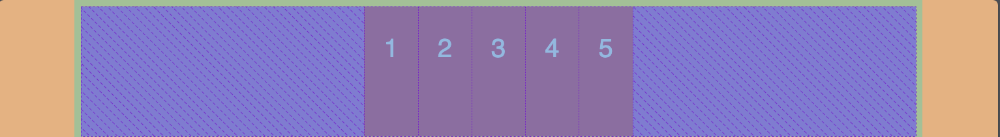

## A TRUE REVOLUTION &mdash;

## Flexbox &mdash;

- Flexbox is a new module in CSS3 that makes it easy to align elements to one another, in different directrions and orders

- The main idea behind flexbox is to give the container the ability to expand and to shrink elements to best use all the available space:

- Flexbox replaces float layouts, using less, and more readable and logical code:

- Flexbox completely changes the way that we build one-dimensional layouts:

- A true revolution in CSS!

<br />


<br />


## Flex Direction &mdash;

<br />

```css
.container {
  display: flex;
  // flex-direction: row; // default
  // flex-direction: row-reverse;
  // flex-direction: column;
  // flex-direction: column-reverse;
}
```

<br />

Flex-direction &mdash; row

<br />


Flex-direction &mdash; row-reverse

<br />


<br />

Flex-direction &mdash; column

<br />


<br />

Flex-direction &mdash; column-reverse

<br />


## Flex Justify-Content &mdash;

Acts vertical in column and horizontal in row &mdash;

```css
.container {
  justify-content: space-between;
  justify-content: space-around; // twice of space than both side
  // justify-content: space-evenly; // equal space size
  // justify-content: flex-start;
  // justify-content: flex-end;
  // justify-content: center;
}
```

Justify-content &mdash; space-between


<br />

Justify-content &mdash; space-around


<br />

Justify-content &mdash; space-evenly


<br />

Justify-content &mdash; flex-start


<br />

Justify-content &mdash; flex-end


<br />

Justify-content &mdash; center



## Align-Item &mdash;

Acts vertical in row and horizontal in column

<br />

Align-item &mdash;

```css
.container {
  // align-items: flex-start;
  // align-items: flex-end;
  // align-items: stretch;
  // align-items: baseline; // adjust baseline of the text
  // align-items: center;
}
```

<br />

align-item &mdash; flex-start

<br />


<br />

align-item &mdash; flex-end

<br />


<br />

align-item &mdash; center

<br />


<br />

align-item &mdash; flex-end

```css
.i4 {
  font-size: 70px;
}
```

<br />


