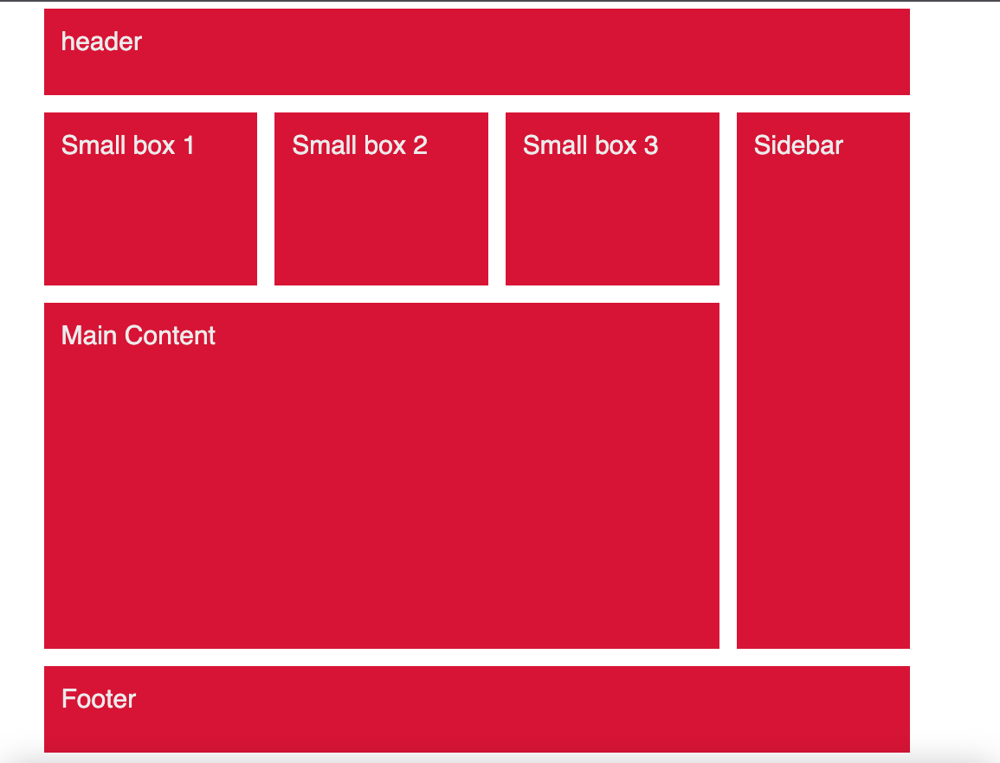

## Challenge &mdash;



## My Code &mdash;

```scss
.container {
  font-family: sans-serif;
  text-transform: capitalize;

  display: grid;
  grid-template-columns: repeat(4, 1fr);
  //   grid-auto-rows: minmax(150px, 1fr);

  grid-gap: 2px;

  & > * {
    background-color: $color__primary;
    color: $color__white;
    font-size: 1.4rem;
    font-weight: 700;
    padding: 1rem;
  }
}

.header {
  grid-area: 1 / 1 / -1 /-1;
  min-height: 80px;
}

article {
  min-height: 180px;
}

.sidebar {
  grid-row: 2 / 4;
}

.main {
  min-height: 500px;

  grid-area: 3 / 1 / 4 / 4;
}

.footer {
  grid-row: 4 / 5;
  grid-column: 1 / -1;

  min-height: 50px;
}
```

## Jonnas Schmedtmann &mdash;

```scss
.container {
  width: 100rem;
  margin: 2rem auto;

  display: grid;
  grid-template-rows: [header-start] 100px [header-end boxes-start] 200px [boxes-end main-start] 400px [main-end footer-start] 100px [footer-end];
  grid-template-columns: repeat(3, [col-start] 1fr [col-end]) 200px [grid-end];

  gap: 2rem;

  & > * {
    background-color: $color__primary;
    color: $color__white;
    font-size: 3rem;
    font-family: sans-serif;
    padding: 2rem;
  }

  @at-root {
    .header {
      //   grid-column: 1 / -1;
      //   grid-row: 1 / 2;

      grid-column: col-start 1 / grid-end;
    }

    .sidebar {
      //   grid-column: 4 / 5;
      //   grid-row: 2 / -2;

      grid-row: boxes-start / main-end;
      grid-column: col-end 3 / grid-end;
    }

    .main {
      //   grid-area: 3 / 1 / 4 / 4;

      grid-column: col-start 1 / col-end 3;
    }

    .footer {
      //   grid-column: 1 / -1;

      grid-column: col-start 1 / grid-end;
    }
  }
}
```

## Grid Naming Area &mdash;

```scss
.container {
  width: 100rem;
  margin: 2rem auto;

  display: grid;
  grid-template-rows: [header-start] 100px [header-end boxes-start] 200px [boxes-end main-start] 400px [main-end footer-start] 100px [footer-end];
  grid-template-columns: repeat(3, [col-start] 1fr [col-end]) 200px [grid-end];

  // Naming Grid Area

  grid-template-areas:
    // "head head head head"

    ". head head ."
    "box1 box2 box3 side"
    "main main main side"
    "foot foot foot foot";

  gap: 2rem;

  & > * {
    background-color: $color__primary;
    color: $color__white;
    font-size: 3rem;
    font-family: sans-serif;
    padding: 2rem;
  }

  @at-root {
    .header {
      grid-area: head;
    }

    .small-box-1 {
      grid-area: box1;
    }

    .small-box-2 {
      grid-area: box2;
    }

    .small-box-3 {
      grid-area: box3;
    }

    .main {
      grid-area: main;
    }

    .sidebar {
      grid-area: side;
    }

    .footer {
      grid-area: foot;
    }
  }
}
```
