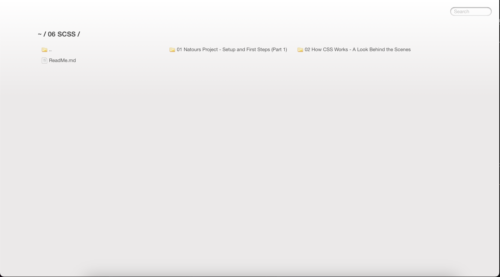

[](#)

> I'm Zaw Linn Tun a Frontend Web Developer on [Zaw Linn - Techno](https://www.youtube.com/@zawlinn-techno). :heart:

<br>

## Projects &mdash;



What I use packages are &mdash;

[](https://skillicons.dev)

<br>

[](#)

1. Open terminal
2. Type this command in terminal and <kbd> Enter</kbd>

   ```sh
   sudo npm install live-server -g
   ```

3. `live-server` on terminal

   `OR`

4. Open with `VS Code` Live Server

<br/>

📫 Reach me out!

[](https://facebook.com/zawlinn.profile) [](https://twitter.com/zawlinn_profile) [](https://www.instagram.com/zawlinn.profile) [](mailto:zawlinn.designer@gmail.com)

<!-- TODO: Add last video link -->

<details>
    <summary>
        My Portfolio
    </summary>
    <br/>

- :earth_asia: I’m currently working at @Mae Sot Market as a sale staff
- :computer: Most used line of code `git commit -m "Initial Commit"`
- :brain: I’m looking for help with Outstanding Video ideas.
- :mailbox_with_mail: How to reach me: zawlinn.designer@gmail.com.
- :heart: In a relationship with React
</details>
